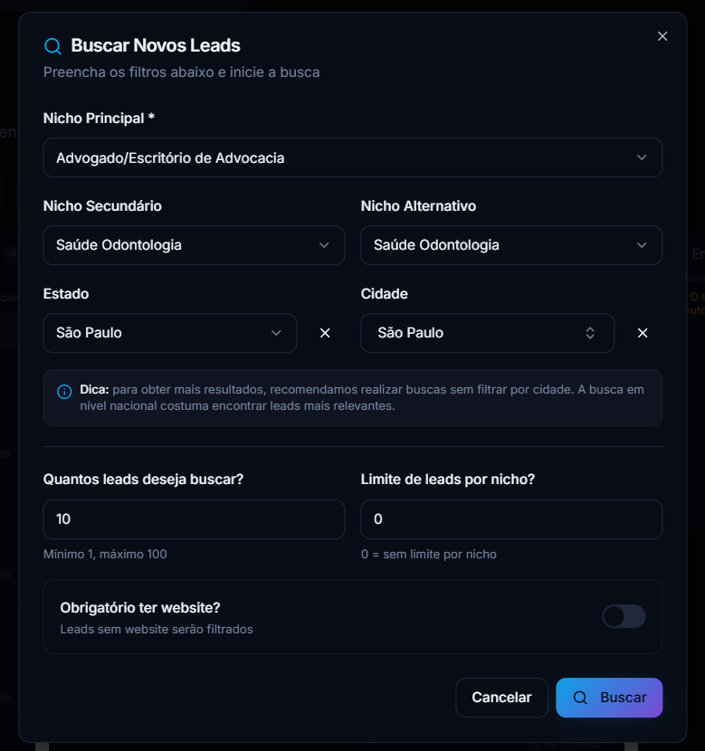
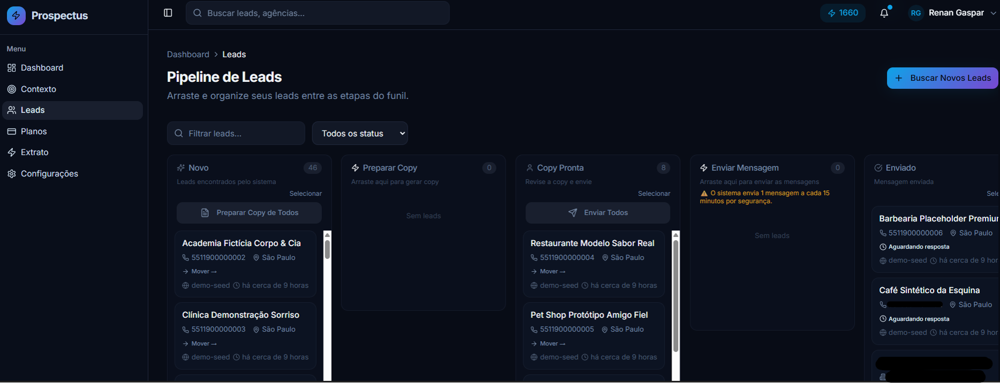
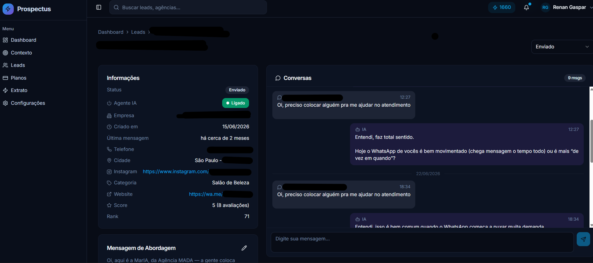
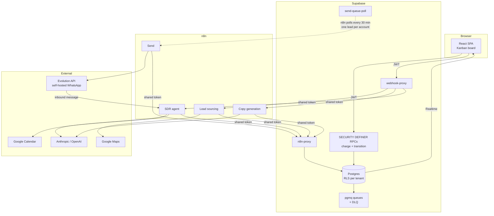

# Prospectus

[](https://github.com/devRenanGaspar/prospectus-ai/actions/workflows/ci.yml)

A WhatsApp prospecting system for Brazilian paid-traffic agencies: it sources
local businesses from Google Maps, writes a personalised first message for each
one, sends it over WhatsApp, and hands the conversation to an SDR agent that
qualifies the lead and books the meeting.

Built and operated solo by [Renan Gaspar](https://github.com/devRenanGaspar) —
renan@agenciamada.com.br. How it was built, including what was generated and
what was not, is in [How this was built](#how-this-was-built) below.

## Status

Live in production at [prospectus.ia.br](https://prospectus.ia.br), serving real
agencies since March 2026. Figures below are read from the production database
on 2026-08-21:

| | |
|---|---|
| Accounts | 160 registered, 12 active in the last 30 days |
| Leads | 11,316 sourced, 6,308 moved past the initial state |
| WhatsApp messages | 11,624 (4,532 from the agent, 6,167 from leads, 925 from a human operator) |
| Tables | 34 domain tables plus one per-tenant `crm_<phone>` table (54 today), all RLS-enabled |
| Automated tests | 221, enforced by CI with a coverage floor |

The lead reply count is worth reading twice: leads sent more messages than the
agent did, which is the only outcome metric here that says the conversations are
real rather than broadcast.



Sourcing: pick a niche and a location, and the pipeline queues a search against
Google Maps.



The board is the state machine. A lead moves `NEW` to `COPY_READY` to `SENT` and
onward, and every paid transition is charged and recorded before the work is
dispatched.



A conversation thread, with the agent's toggle and the generated opening message
alongside it.

The leads in these screenshots are synthetic, seeded by the script below, with
one exception: the conversation view is a real thread, because a synthetic one
has no messages in it. Its identifying fields — name, phone, company, Instagram
— are blacked out; the business category, city and rating are not.

### Demo

Production screenshots would expose real customers, so the repository ships a
seeded synthetic tenant instead:

```bash
DEMO_EMAIL=... DEMO_PASSWORD=... DEMO_LEAD_PHONE=55DDDNUMBER \
  node scripts/demo/seed-synthetic-leads.mjs

node scripts/demo/cleanup-synthetic-leads.mjs   # exact inverse
```

The seed authenticates as a normal user and writes through RLS, uses invalid
`5511 90000-00xx` placeholder numbers, and never places a lead in `COPY_PENDING`
or `SEND_PENDING` — those are processing states, and `SEND_PENDING` is polled by
the send queue, so seeding into it would fire a real WhatsApp message.

## How this was built

This repository is a squashed public snapshot of a project developed over
several months — it was not written in one sitting, and that's worth stating
plainly rather than leaving a reader to guess from a single commit.

**The starting point was generated.** The first version was a CRUD skeleton
produced with [Lovable](https://lovable.dev), an AI app builder: the Kanban
board, the shadcn/ui component library, the auth screens, the initial schema.
`src/integrations/lovable/` is still there and still in the Google sign-in
path.

**The implementation since has been AI-assisted throughout**, with
[Claude Code](https://claude.com/claude-code) as a working partner across
most of it. That is accurate and it stays.

**What the generator did not do is the part worth reviewing.** A code generator
does not notice that `public.messages` has had no write for four days while the
agent workflows run clean, and conclude from the silence that n8n is writing to
the wrong Supabase project. It does not decide that a charge and its outcome
must not be able to diverge, and rewrite a client-side debit-then-transition
into one idempotent `SECURITY DEFINER` RPC. It does not reason that the
highest-harm failure of a forced cutover is a silenced SDR agent resuming
messaging, and rescue 154 leads' on/off flags before repointing anything. It
does not decide which of two model providers gets a real fallback and which
does not, and write down why.

Those decisions are mine, and they are the ones the artifacts below record:

- [`docs/adr/`](docs/adr/) — six decisions with the alternatives and the costs
- [`docs/incidents.md`](docs/incidents.md) — three production incidents, including
  one where the detection worked and the response did not
- [`docs/eval-report.md`](docs/eval-report.md) — an eval harness that found a
  real Portuguese verb-agreement bug in a production grounding check
- [`docs/security-risk-register.md`](docs/security-risk-register.md) — accepted
  risks with applicability and review dates

The honest summary: the typing was largely automated, the judgement was not,
and the system runs in production with paying customers on the strength of the
second. Read the ADRs and the incident log first — they are the parts a
generator could not have written.

## The problem

A paid-traffic agency in Brazil prospects by hand: search Google Maps, open each
business, judge whether it is worth contacting, write a message that does not
read like a template, send it, follow up. It is hours of work per day, and the
message quality collapses as the volume grows. Prospectus does the sourcing,
the writing and the first conversation, and gives the operator a board where the
only manual step left is the meeting itself.

## Architecture



The browser never calls n8n directly. Outbound goes through `webhook-proxy`,
which resolves the target URL from `webhook_configs` and injects the
authenticated `user_id` rather than trusting the client's. Inbound goes through
`n8n-proxy` with a shared token and the service role. State changes reach the UI
over Supabase Realtime.

Sending is deliberately pull-based: n8n polls `send-queue-poll` every 30 minutes
and receives at most one lead per account. That is the rate limiter that keeps a
WhatsApp number from being flagged.

Conversation state is per-tenant, in a `crm_<phone>` table per account rather
than a shared table — inherited from the pre-migration n8n workflow's fallback
node; see [ADR 0005](docs/adr/0005-force-cutover-without-full-migration.md) for
why.

## Models per stage

| Stage | Model | Fallback | Why |
|---|---|---|---|
| Copy generation | `claude-sonnet-5` | `gpt-5.2` | The first message decides whether a conversation happens. This stage gets the strongest instruction-following available, because the prompt is mostly a long list of prohibitions (no promised results, no accusatory tone, no marketing register) and violations are what make a message read as automated. |
| SDR agent | `gpt-5.2` | none | Multi-turn, tool-calling (calendar, knowledge base, lead enrichment), latency-sensitive because a human is waiting in a WhatsApp thread. |
| Message splitting | `gpt-5.2` | none | Mechanical: break a long reply into WhatsApp-sized parts. No reasoning required. |

The copy stage runs a real provider fallback: if Anthropic fails the same prompt
is retried against OpenAI, because a failed copy generation has already charged
the customer's credits. The SDR agent has no cross-provider fallback; its model
call retries up to 3 times against the same provider with a 5 s backoff, which
absorbs rate limits and transient blips but not a sustained OpenAI outage — that
gap is still open, listed below.

There is no retrieval or vector search anywhere in this system. Lead context is
assembled by direct lookups (Google Maps fields, reviews, site and Instagram
scrapes) and passed inline. Calling that RAG would be inaccurate.

## Reliability

The system charges money before it does work, so most of the reliability effort
went into making sure a charge and its outcome cannot diverge.

**Charging is transactional.** Every paid action is a single `SECURITY DEFINER`
RPC that debits credits and transitions the lead in one transaction. The RPCs
are idempotent by `request_id`, and a lead already in the destination state
costs zero — a double click charges once.

**The client cannot forge a paid action.** A trigger rejects direct transitions
into `COPY_PENDING` / `SEND_PENDING`, `INSERT` on the request tables is revoked
from `authenticated`, and `webhook-proxy` only forwards a paid operation if it
references an already-charged request, using the parameters stored on that
record rather than the ones the client sent.

**Partial failures refund automatically.** A trigger on `lead_searches` returns
credits for results that were charged but never delivered.

**Email delivery is queued, not inline.** Auth emails go through `pgmq` with a
TTL, a dead-letter queue, and the queue's `message_id` reused as the provider
idempotency key, so replaying an ambiguous failure does not send twice.

**Operational views are the alerting surface.** Read-only, admin-scoped:

- `ops_stuck_leads` — charged but never delivered
- `ops_stuck_searches` / `ops_stuck_copy_requests` — request stuck in processing
- `ops_orphan_charges` — a debit whose request does not exist
- `ops_double_sends` — the same lead charged twice for `SEND_MESSAGE`

These are not decorative. In August 2026 they were what surfaced a production
incident in which n8n's published workflows were still writing to a
pre-migration Supabase project while the application ran against the current
one. Copy generation was charged here and completed there, so 191 leads sat in
`COPY_PENDING` for four days. `ops_stuck_leads` had it flagged the whole time.
717 credits were refunded and the leads were returned to `NEW`; the migration is
recorded in `supabase/migrations/`. The root cause was a half-finished cutover,
and the detection worked while the response did not — nothing was paging anyone.

## Evaluation and testing

221 tests run in CI on every pull request -- 201 under Vitest, 20 under Deno,
the two counted separately because the Deno suite drives the deployed edge
function handlers directly through a routed fetch stub rather than importing
them into the Vitest/jsdom environment they don't run in. Alongside them: lint,
a type-check under `strict`, a separate `deno check` over the twelve edge
functions (which the frontend type-check does not reach), three SQL contracts
against a database rebuilt from the migrations alone, a coverage floor, a
bundle-size budget, an orphan-dependency check, a check that the secret
inventory in `docs/environment-variables.md` matches the actual
`Deno.env.get()` call sites, a production dependency audit, and CodeQL. The
combined test count is itself checked (`npm run test:count`), so a suite that
changes size without the README being updated fails CI rather than drifting
silently. On a merge to `main`, a further job deploys every Supabase edge
function, with no path filter and no per-function list -- see the comment
above that job in `.github/workflows/ci.yml` for why.

| Suite | What it holds down |
|---|---|
| `credit-flows` | charge/refund arithmetic, idempotency, double-click safety |
| `copy-quality` | grounding checks on generated copy |
| `copy-grounding-checks` | offline port of the same 9 grounding heuristics against synthetic fixtures — see below |
| `n8n-proxy-contract` | `n8n-proxy`'s request shapes for 9 of its ~25 actions, as zod schemas (`src/lib/n8n-proxy-contract.ts`) — not wired into the live function, a documented, test-checked mirror of it |
| `operational-telemetry` | attribute allow-listing, error-code sanitisation |
| `observability` / `system-health` | queue metrics and health rollups |
| `supabase/functions/_tests/` (Deno) | the deployed edge function handlers, called directly: the full credential-tier matrix across all 26 `n8n-proxy` actions, the calendar-token-exchange failure modes, the safety deadline, and audit-before-privileged-action for the two admin endpoints |

`npm run eval` runs [`evals/copy-grounding/`](evals/copy-grounding/), a small
offline harness that exercises the same grounding checks that run daily in
production (`ops_copy_quality`) against 12 synthetic lead/copy fixtures — no
database, no LLM call. It found a real bug the first time it ran: the
production regex for "denies having a site/pixel" only matched the singular
verb form (`tem`), not the grammatically correct plural (`têm`) an LLM is more
likely to actually produce, silently undercounting one check by 83%. Fixed in
`supabase/migrations/20260817003458_copy_quality_verb_agreement.sql`; full
writeup in [`docs/eval-report.md`](docs/eval-report.md).

The honest gap: this covers the grounding *heuristics*, not the generation
stage itself. There is still no held-out set of leads with graded expected
messages for the copy the model actually writes, so a prompt change to
`20_Generate_Message` is validated by reading samples rather than by a score.
Building that is still the top item on the roadmap — `evals/copy-grounding/`
is a smaller, already-useful step toward it, not a replacement for it.

## Cost and latency per lead

Costs are infrastructure costs, not customer pricing.

Per lead, one copy generation is one LLM call. Sampled from production execution
`1191133`: **4,694 prompt tokens, 166 completion tokens** against
`claude-sonnet-5`, 4.6 s at the model. The prompt is a fixed template plus a
small lead context, so variance across leads is low. Sourcing costs roughly
**USD 1 per 1,000 results** from the Maps provider. WhatsApp delivery runs on a
self-hosted Evolution API, so it is fixed infrastructure rather than per-message.

Token usage is not persisted anywhere — these numbers come from reading n8n
execution records by hand, which is why this section quotes one sampled
execution rather than a distribution.

Latency, measured over completed requests with a positive observed duration,
from 2026-06-11 onward:

| Stage | n | p50 | p95 | p99 |
|---|---|---|---|---|
| Copy generation | 823 | 34 s | 12 min | 20 min |
| Lead sourcing | 210 | 5.5 min | 82 min | 22 h |
| Send | 182 | 8.9 min | 87 min | 2.5 h |
| Lead's first reply | 729 | 54 s | — | — |

Read these with the caveat they deserve. Send latency is dominated by design,
not by slowness: the queue is polled every 30 minutes and delivers one lead per
account, so the p50 is mostly queue wait. Sourcing p99 is contaminated by rows
that sat for a day or more before being marked complete.

More importantly, the instrumentation itself is only partly trustworthy.
`completed_at` is at or before `created_at` on 40% of searches, 43% of copy
requests and 72% of timestamped send requests, and only 652 of 1,335 completed
send requests carry a `completed_at` at all. Those rows are excluded from the
table above, which is why `n` is far below the completed-row count. The
timestamps are written by n8n from its own clock; fixing that is on the roadmap
and is a precondition for treating any of these percentiles as an SLO.

## Running it locally

Requires Node 22.16.0, pinned in `.node-version` and `.nvmrc`, including for
Cloudflare Pages builds.

```bash
npm install
cp .env.example .env          # PowerShell: Copy-Item .env.example .env
# fill in your Supabase project URL and publishable key

npm run dev      # http://localhost:8080
npm run test     # vitest
npm run check    # lint + types (src and edge functions) + coverage + build + bundle budget
```

What you get is the full application against your own Supabase project: the
migrations in `supabase/migrations/` rebuild the schema from scratch when
applied in order, so auth, the Kanban board, the credit ledger and RLS all work.

What you do not get is the automation layer. Lead sourcing, copy generation,
sending and the SDR agent run as n8n workflows against Google Maps, a WhatsApp
gateway and paid model APIs, and the workflows themselves — prompts,
credentials, exact parameters — don't live in this repository (`/orchestration`
documents one workflow's structure, not its content). Without an n8n instance
and those credentials the pipeline stages accept work and never complete it.
This is the honest boundary of what is reproducible here.

`docs/engineering-baseline.md` has the quality bar, accepted risks and release
process. `docs/database-change-checklist.md` covers schema changes.
`docs/environment-variables.md` inventories every secret the system reads and
where it's read from. `docs/adr/` records why specific architectural
decisions were made; `docs/incidents.md` is the writeup behind the
"Reliability" incident above and two others.

## Limitations and roadmap

Known and unfixed, in the order they matter:

1. **No offline eval set for the copy-generation stage itself.** `evals/copy-grounding/`
   covers the grounding heuristics that check generated copy against the lead's
   own data; there is still no held-out, graded set for the generation prompt
   itself, so a prompt change is validated by reading output. This is the
   single biggest remaining gap.
2. **The SDR agent has no cross-provider model fallback.** Its model call now
   retries on the same provider (3 tries, 5 s backoff) to absorb transient
   failures, but a sustained OpenAI outage still silently stalls live
   conversations — there is no second provider wired in, unlike copy
   generation.
3. **Inbound messages are dropped silently when a phone number does not resolve
   to exactly one lead.** No alert, no dead-letter — the message is lost.
4. **Latency instrumentation is unreliable**, as quantified above.
5. **The Supabase cutover is not finished.** Some n8n nodes still read and write
   per-tenant conversation state in the pre-migration project. Repointing them
   requires migrating that state first, or in-flight conversations lose their
   memory and the per-lead agent on/off flag.
6. **No paging.** Operational views detect problems correctly; nothing wakes
   anyone up. The August incident ran for four days under a working detector.
7. **Workflows are not version-controlled.** They live in n8n, edited through
   its UI, with drafts that diverge from the published version.
   [`/orchestration`](orchestration/) documents the SDR agent workflow's
   structure by hand as a first step; the workflows themselves — prompts,
   credentials, exact parameters — are still not exported or diffable.

## Layout

```
src/
  components/   UI; shadcn/ui under components/ui/
  contexts/     AuthContext
  hooks/        TanStack Query hooks
  integrations/ Supabase client (types.ts is generated, do not edit)
  lib/          constants, utils, n8n contract
  pages/        routes
evals/          offline eval harnesses for the LLM-dependent stages
orchestration/  hand-maintained n8n workflow structure docs
supabase/
  config.toml   verify_jwt per function
  functions/    edge functions (Deno)
  migrations/   versioned SQL
scripts/demo/   synthetic tenant seed and cleanup
docs/           engineering baseline, runbooks, checklists
```

### Edge functions

| Function | Auth | Direction |
|---|---|---|
| `webhook-proxy` | user JWT | app to n8n |
| `n8n-proxy` | `N8N_SHARED_TOKEN` | n8n to database (service role) |
| `send-queue-poll` | `N8N_SHARED_TOKEN` | n8n pulls the send queue |
| `google-calendar-auth-url` | user JWT | app to Google |
| `google-calendar-callback` | public | Google to app |
| `google-calendar-disconnect` | user JWT | app |
| `admin-impersonate` | admin JWT | audited |
| `admin-update-password` | admin JWT | audited |
| `auth-email-hook` | webhook signature | Auth to queue |
| `process-email-queue` | `X-Email-Queue-Token` | cron to delivery |
| `send-ops-alert` | `X-Ops-Alert-Token` | cron to delivery (ops alerts, e.g. copy quality) |
| `frontend-telemetry` | user JWT | browser to Supabase (privacy-safe collector) |

Functions authenticating by shared token need `verify_jwt = false` in
`supabase/config.toml`, otherwise the gateway rejects the call before the
function runs. Postgres cron jobs cannot obtain a Supabase JWT, which is why
those paths use tokens held in the vault instead.

## Language

Code, commit messages and documentation are in English. Product copy, UI
strings and the model prompts are in Brazilian Portuguese, because the product
is sold in Brazil and the agent writes to Brazilian business owners over
WhatsApp. The prompts themselves stay in the n8n instance and are not published
here.

One exception, visible on the first file you open in `supabase/migrations/`:
SQL statements in an applied migration are never rewritten here — editing
history a database has already executed trades a real risk for a cosmetic
gain — so roughly 376 comment lines across 25 migration files stay in
Portuguese, and `supabase/config.toml` is entirely so. A migration's
*comments* may still be edited when a diff of statements alone proves nothing
executable changed (`docs/database-change-checklist.md`), which is how a few
of those files carry English prose today; new migrations are written in
English throughout. Application code, tests and everything outside
`supabase/migrations/` are English regardless of date.

## License

Public for portfolio purposes. The code carries no redistribution licence
(`UNLICENSED`); all rights reserved.

## Security

Do not open an issue containing a vulnerability or real customer data. See
[SECURITY.md](SECURITY.md) for private reporting.

## Contributing

Changes go through a pull request and the `CI` workflow. See
[CONTRIBUTING.md](CONTRIBUTING.md) and the
[database change checklist](docs/database-change-checklist.md).

© Renan Gaspar
