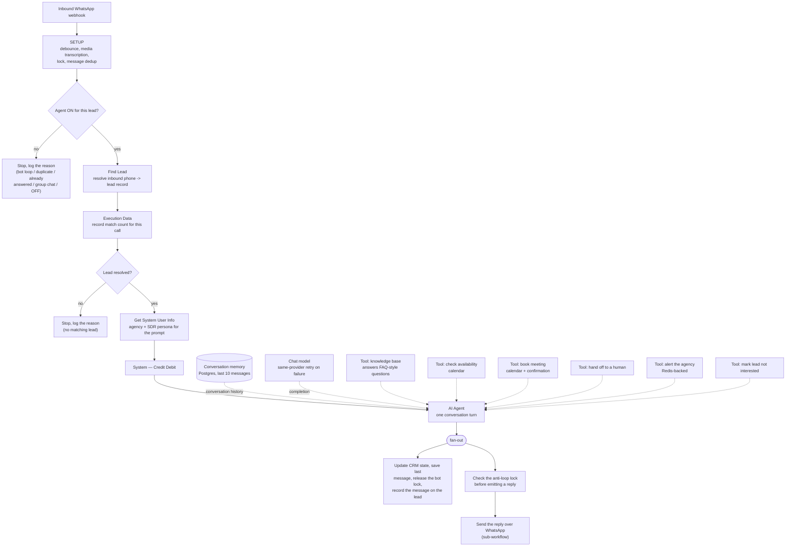

# SDR agent workflow

Structure of the WhatsApp SDR agent's n8n workflow — the "SDR agent" box in
the main README's architecture diagram, one level deeper. Read from the live
workflow's node list and connection graph on 2026-08-16; not an export, not
run, and not exhaustively re-verified edge by edge — see the limitations in
[`README.md`](README.md).

Two near-identical copies of this workflow run in production: the main one
and a template cloned for new tenants. They share this shape; node counts and
a few tool implementations differ slightly between them.

## Flow

## What each part is actually doing

**Gating (`SETUP` → agent-on check).** Before the agent runs at all: debounce
rapid-fire messages into one, transcribe voice notes and describe attached
images/documents, take a lock, and check whether this message needs a reply
at all — a message the business itself sent, a duplicate, a group chat, or a
lead with the agent switched off all exit here without calling the model.

**Lead resolution.** The inbound WhatsApp number is resolved to a lead record
by phone. This is the lookup made deterministic against duplicate phone
numbers within a tenant, and instrumented so every call now records how many
leads matched even when the branch that follows doesn't change — see the
"Inbound messages are dropped silently..." item in the [README's
roadmap](../README.md#limitations-and-roadmap) for the gap this only
partially closes.

**Context assembly.** Agency name and the configured SDR persona get read for
the prompt; a credit-debit call runs before the agent does. No retrieval
step — see [ADR 0001](../docs/adr/0001-no-retrieval-augmented-generation.md).

**The agent call.** One LangChain agent node, Postgres-backed memory scoped
to the last 10 messages, six tools it can call mid-turn. The tools that touch
the calendar and hand-off paths are themselves n8n sub-workflows, not raw API
calls — each one is its own workflow with its own error handling. The model
node retries on the same provider on failure ([ADR
0003](../docs/adr/0003-asymmetric-model-fallback.md)); the agent node itself
does not duplicate or retry, since re-running the whole turn after a tool
already fired (e.g. a calendar booking) would not be safe to repeat.

**After the agent replies.** Everything downstream of the agent call runs in
parallel, not in sequence: the CRM-visible conversation state updates, the
last-message-sent record updates (used for the bot-loop guard), the
processing lock releases, and the message gets attached to the lead's
history. Sending back to WhatsApp goes through a dedicated sub-workflow and a
Redis-backed lock that exists specifically to stop the agent from replying to
its own messages in a loop.
